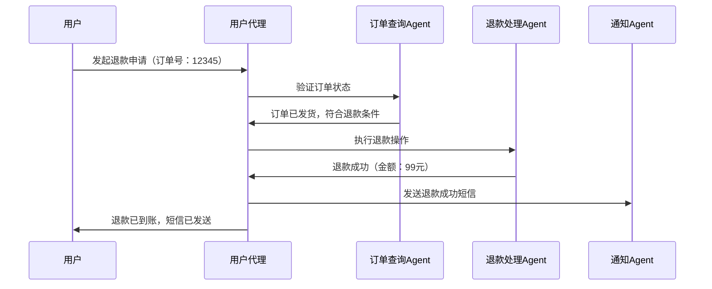

# L3: 大模型Agent应用架构进阶实践
## 一、Agent核心认知
### 1. 定义与核心特性
- **定义**：Agent是具备环境感知、自主决策、持续学习能力的程序实体，能通过与环境交互自主完成复杂任务，是AI从“工具”向“智能体”进化的核心形态。
- **四大核心特性**：
  - 自主性：无需人类直接干预，独立制定决策与执行计划。
  - 适应性：能学习环境变化，动态调整行为策略（如处理异常反馈）。
  - 交互性：理解自然语言，可与人类、其他Agent或工具进行跨模态交互。
  - 功能性：聚焦特定领域执行任务（从简单数据分析到复杂流程自动化）。

### 2. 核心价值与应用边界
- **核心价值**：将大模型的“推理能力”与工具的“执行能力”结合，实现“目标输入→自动拆解→分步执行→结果输出”的端到端闭环，替代重复的人工流程。
- **适用场景**：自动化测试、智能客服、库存调度、多步骤数据分析、流程审批等需要动态决策的场景。
- **应用边界**：暂不适合强实时性（如毫秒级响应）、高风险决策（如无人化手术核心操作）、需物理交互的极端场景（如深海探测）。

## 二、Agent核心架构要素
Agent的底层架构由四大核心模块构成，各模块协同实现“感知-决策-执行”闭环：

### 1. 规划（Planning）：任务拆解与决策
- **核心作用**：将复杂目标拆解为可执行的子任务，制定执行顺序与策略，处理异常调整。
- **关键技术**：
  - 任务分解：通过思维链（CoT）、思维树（ToT）将大任务拆分为步骤（如“电商退款”拆解为“查询订单→验证资格→发起退款→通知用户”）。
  - 自我反思：通过Reflexion框架回顾执行结果，修正错误（如检测到数据缺失时自动补充检索步骤）。
  - 外部规划器集成：结合PDDL（规划领域描述语言）处理复杂流程（如供应链调度）。

### 2. 记忆（Memory）：上下文与知识存储
- **分类与作用**：
  - 短期记忆：存储当前会话上下文（如多轮对话历史），依赖Prompt上下文窗口实现。
  - 长期记忆：存储历史任务结果、领域知识，通过向量数据库（如FAISS、Milvus）实现高效检索。
- **技术实现**：
  - 短期记忆：LangChain的`ConversationBufferMemory`直接存储对话内容。
  - 长期记忆：通过`VectorStoreRetrieverMemory`将关键信息向量化后存入数据库，需用时检索。

### 3. 工具（Tools）：能力扩展接口
- **核心作用**：弥补大模型原生能力不足（如实时数据获取、代码执行、API调用），是Agent与外部世界交互的桥梁。
- **工具分类**：
  - 预制工具：搜索引擎（SerpAPI）、计算器、代码解释器、文件读写、数据库查询。
  - 自定义工具：企业内部API（如ERP系统接口）、领域专用工具（如医疗影像分析工具）、第三方服务（如邮件发送、支付接口）。
- **工具调用关键**：通过JSON Schema定义工具参数，让大模型自动识别调用场景与参数格式。

### 4. 执行（Action）：任务落地与反馈
- **核心流程**：根据规划结果调用工具，获取执行反馈，动态调整下一步行动（如调用数据接口失败时自动重试或切换备用工具）。
- **关键保障**：
  - 异常处理：捕获工具调用错误（如网络超时、参数错误），生成 fallback 方案。
  - 结果解析：将工具输出（如JSON数据、文本结果）转化为大模型可理解的格式，用于后续决策。

## 三、Agent核心认知框架（实战导向）
不同场景需适配不同认知框架，以下是主流框架的核心逻辑与应用场景：

### 1. ReAct框架：推理-行动循环
- **核心逻辑**：通过“思考（Reasoning）→行动（Acting）→观察（Observation）”的循环动态调整策略，强调与环境的实时交互。
- **执行流程**：
  ```python
  # 简化流程伪代码
  while not task_done:
      thought = llm.generate("基于当前状态，下一步该做什么？")  # 推理
      action = select_tool(thought)  # 选择工具
      observation = tool.execute(action)  # 执行并获取反馈
      update_memory(observation)  # 更新记忆
  ```
- **适用场景**：需要实时数据、动态反馈的任务（如网络调研、自动化测试、智能客服）。
- **工具支持**：LangChain的`create_react_agent`可快速实现。

### 2. Plan-and-Execute框架：先规划后执行
- **核心逻辑**：分两阶段执行——先通过大模型生成完整执行计划，再按步骤调用工具执行，适合流程固定、步骤明确的任务。
- **优势与局限**：
  - 优势：流程可追溯，适合合规场景（如财务审批）。
  - 局限：灵活性不足，环境变化时需重新规划。
- **适用场景**：库存调度、标准化报告生成、固定流程自动化（如员工入职流程）。

### 3. Self-Ask & Reflection框架：自我问答与修正
- **核心逻辑**：Agent通过自我提问补充缺失信息，再通过反思修正执行偏差（如“数据分析时发现缺少2024年数据→自我提问‘如何获取2024年销售数据’→调用数据库接口”）。
- **适用场景**：信息不完整的任务（如市场调研、竞品分析）。

### 4. Function Calling框架：结构化工具调用
- **核心逻辑**：通过JSON Schema定义函数，大模型自动生成符合格式的调用参数，实现精准工具触发。
- **执行步骤**：
  1. 定义函数与参数（如“get_weather(location: str, date: str)”）。
  2. 大模型解析用户需求，生成函数调用指令（JSON格式）。
  3. 执行函数并获取结果，回传给大模型生成自然语言回答。
- **适用场景**：API调用、数据库查询、工具类任务（如天气查询、订单查询）。

## 四、主流Agent开发框架（对比与选型）
| 框架         | 核心定位                  | 优势                          | 适用场景                          | 代码复杂度 |
|--------------|---------------------------|-------------------------------|-----------------------------------|------------|
| LangChain    | 全流程Agent开发工具箱      | 组件丰富、支持多模型、工具集成广 | 定制化Agent（如自动化测试Agent）    | 中等       |
| LlamaIndex  | 聚焦RAG+Agent融合         | 检索优化、文档处理能力强       | 知识库问答Agent（如HR制度问答）      | 低-中等    |
| AutoGPT      | 零代码自主Agent           | 开箱即用、支持多任务串联       | 探索性任务（如全网调研、报告生成）  | 低         |
| BabyAGI      | 模块化多Agent协作          | 任务队列管理、动态优先级调整   | 流程化任务（如数据处理流水线）      | 中等       |
| CAMEL        | 角色扮演式多Agent协作      | 创意生成、跨角色交互          | 创意任务（如产品设计、文案共创）    | 中等       |
| AutoGen      | 多Agent分工协作           | 代码执行优化、人工干预灵活    | 技术类任务（如代码生成、数据分析）  | 中等-高    |
| MetaGPT      | 软件工程化Agent框架       | 流程标准化、支持团队角色模拟   | 软件项目开发（需求→设计→编码→测试） | 高         |

### 框架选型建议
- 快速验证想法：优先用AutoGPT（零代码）或LangChain（简单Agent）。
- 知识库相关Agent：优先LlamaIndex（检索能力强）。
- 多角色协作任务：CAMEL（创意类）或AutoGen（技术类）。
- 企业级流程自动化：LangChain（定制化）或MetaGPT（标准化流程）。

## 五、Agent开发实战：核心步骤与代码示例
以“自动化测试Agent”为例，基于LangChain实现核心流程：

### 1. 开发核心步骤
1. 定义Agent角色与目标（如“测试工程师，自动生成登录功能测试用例并执行”）。
2. 配置工具（如测试用例生成工具、Selenium执行工具、报告生成工具）。
3. 选择认知框架（如ReAct）。
4. 集成记忆模块（存储历史测试结果）。
5. 部署执行器，处理异常反馈。

### 2. 极简代码示例（LangChain实现）
```python
# 1. 导入依赖
from langchain.agents import create_react_agent, AgentExecutor
from langchain_openai import ChatOpenAI
from langchain.tools import Tool
from langchain_core.prompts import ChatPromptTemplate
from langchain.memory import ConversationBufferMemory

# 2. 定义工具（示例：测试用例生成、Selenium执行）
def generate_test_cases(requirement):
    """生成测试用例的工具"""
    return f"登录功能测试用例：\n1. 正常账号密码登录\n2. 空账号登录\n3. 错误密码登录"

def run_selenium_test(case):
    """执行Selenium测试的工具"""
    return f"测试执行结果：成功覆盖3条用例，无阻塞缺陷"

tools = [
    Tool(name="生成测试用例", func=generate_test_cases, description="根据需求文档生成测试用例"),
    Tool(name="执行Selenium测试", func=run_selenium_test, description="执行自动化测试用例并返回结果")
]

# 3. 配置Prompt与记忆
prompt = ChatPromptTemplate.from_messages([
    ("system", "你是自动化测试专家，用ReAct框架完成测试任务：先生成用例，再执行测试，最后输出报告"),
    ("human", "{input}"),
    ("memory", "{chat_history}")
])
memory = ConversationBufferMemory(memory_key="chat_history", return_messages=True)

# 4. 初始化Agent与执行器
llm = ChatOpenAI(model="gpt-4-turbo-preview", temperature=0.3)
agent = create_react_agent(llm=llm, tools=tools, prompt=prompt, memory=memory)
agent_executor = AgentExecutor(agent=agent, tools=tools, verbose=True, handle_parsing_errors=True)

# 5. 执行任务
result = agent_executor.invoke({"input": "为电商登录功能设计并执行自动化测试"})
print(result["output"])
```

### 3. 关键优化点
- 工具描述：需明确“触发场景”（如“当需要生成测试用例时调用”），帮助大模型判断调用时机。
- 温度参数：测试、财务等场景建议`temperature=0.3`（降低随机性），创意类场景可设为`0.7`。
- 异常处理：通过`handle_parsing_errors=True`自动处理工具调用格式错误。

## 六、多Agent协作系统
当单Agent无法完成复杂任务时，多Agent协作通过角色分工提升效率，核心模式如下：

### 1. 协作模式
- **分工协作**：不同Agent承担特定角色（如“需求分析Agent→架构设计Agent→编码Agent→测试Agent”）。
- **角色扮演**：CAMEL框架中，Agent分为“用户角色”（如产品经理）和“助手角色”（如开发者），通过对话推进任务。
- **层级协作**：高层Agent负责决策（如“项目管理Agent”），低层Agent负责执行（如“代码生成Agent”）。

### 2. 典型案例：电商退款多Agent系统


### 3. 协作关键技术
- 通信协议：通过消息队列（如Redis）实现Agent间异步通信，支持“广播”“点对点”消息。
- 冲突解决：采用Borda计数法对多Agent方案投票（如多个编码Agent生成的代码选择最优版本）。
- 任务调度：通过MetaGPT的`SoftwareCompany`类管理多角色Agent的执行顺序。

## 七、Agent常见挑战与应对策略
| 挑战类型       | 具体问题                          | 应对策略                                  |
|----------------|-----------------------------------|-------------------------------------------|
| 技术挑战       | 任务漂移（偏离初始目标）           | 定期反思校正，设置任务边界提示            |
|                | 工具调用错误（参数错误、工具选错） | 优化工具描述，添加参数校验（如Pydantic）    |
|                | 记忆过载（长任务上下文溢出）       | 分块存储记忆，仅保留关键信息              |
| 性能挑战       | 响应延迟（多步骤调用耗时）         | 并行执行可同步任务，缓存高频工具结果       |
|                | 算力成本高（多次LLM调用）          | 低重要步骤用轻量模型（如Llama-2-7B）      |
| 安全挑战       | 敏感信息泄露（工具调用时暴露数据） | 输入输出脱敏，本地化部署敏感工具          |
|                | 恶意工具调用（如执行危险代码）    | 白名单限制工具，代码静态分析（如Semgrep）  |

## 八、学习路径与实践建议
### 1. 入门阶段（1-2周）
- 掌握核心概念：理解Agent四大模块、ReAct框架流程。
- 工具实践：用LangChain实现单工具Agent（如“天气查询Agent”）。
- 核心目标：能独立搭建“输入→工具调用→输出”的简单闭环。

### 2. 进阶阶段（1-2个月）
- 框架深入：学习LangChain的Memory、Chain组件，实现多工具协作。
- 多Agent实践：用CAMEL实现双Agent角色扮演（如“开发者+测试工程师”协作）。
- 项目实战：开发“自动化周报生成Agent”（调用数据库→数据分析→生成报告→发送邮件）。

### 3. 高阶阶段（2-3个月）
- 定制化开发：自定义工具（如对接企业内部API）、优化Prompt工程（思维链+格式约束）。
- 性能优化：实现Agent执行缓存、并行调度、成本监控（如token消耗统计）。
- 企业级落地：开发“HR智能问答Agent”“库存调度Agent”，解决实际业务问题。

## 九、核心工具链清单
| 工具类型       | 推荐工具/框架                          | 核心作用                                  |
|----------------|---------------------------------------|-------------------------------------------|
| 基础框架       | LangChain、LlamaIndex                 | Agent核心组件（记忆、工具、链）封装        |
| 多Agent框架    | AutoGen、CAMEL、MetaGPT               | 多Agent协作、角色模拟、流程标准化          |
| 向量数据库     | FAISS（本地）、Milvus（分布式）、Pinecone（云服务） | 长期记忆存储与高效检索                    |
| 工具集成       | SerpAPI（搜索）、Selenium（自动化测试）、SQLDatabase（数据库） | 扩展Agent能力边界                        |
| 开发工具       | Cursor（智能编码）、LangSmith（调试监控） | 提升开发效率、监控Agent执行流程            |
| 部署工具       | FastAPI（API暴露）、Docker（容器化）、K8s（集群部署） | 企业级部署与扩展                          |

要不要我帮你整理一份**Agent实战项目模板**（含完整代码、注释与部署步骤），覆盖“多工具协作+记忆存储+异常处理”核心功能？